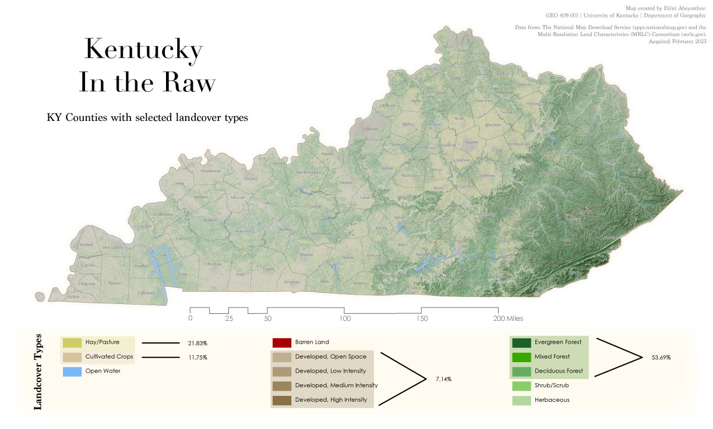
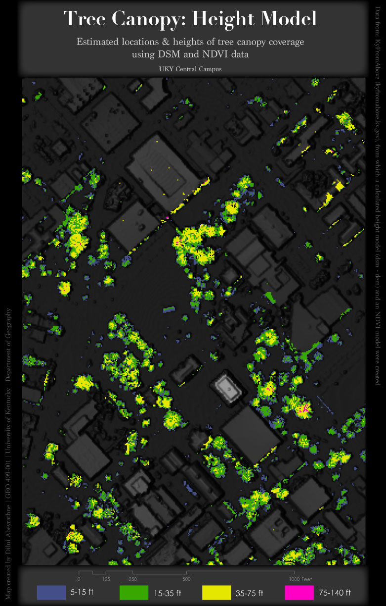

# GEO409 Field Trip - Maps
Two maps are included for the class field trip, visualizing Kentucky's various landcover types and tree canopy coverage across UKy's central campus area.

## Kentucky's Landcover Types
Below is a map of selected landcover types for Kentucky and its counties. 

   
Download the map here – [geospatial PDF](M4_KY_landcover2.pdf)

## Tree Canopy at UKY's Central Campus
Below is a map measuring canopy height of trees within the University of Kentucky's central campus area.

   
Download the map here – [geospatial PDF](M4_UKY_trees2.pdf)

These maps were created by Dilni Abeyrathne ([@DTAbeyrathne](https://github.com/DTAbeyrathne)) for the GEO409-001 (Spring 2023) class in the University of Kentucky's Department of Geography. This webpage visualization was published on March 5th, 2023.

